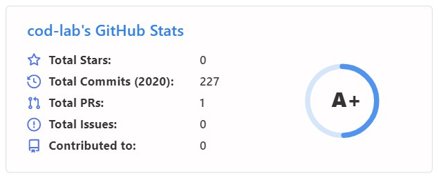

<h1 align=center>Self Updating README</h1>

### <ins>1. Github Status Cards</ins>
- The image you see on the top right and the bottom can be created for anyone.
- Just add these links in your README (with your username):
- Top Image:   
- ``
- Bottom Image:   
- ``
- It is created by [Anurag Hazra](https://github.com/anuraghazra).
- You can follow his [repo](https://github.com/anuraghazra/github-readme-stats) for more info and card configurations.

 

### <ins>2. Latest Github Repos</ins>
To display your latest repos which must be updated automatically you need two things:

- `a script which can update your README if there is any update.`
  - i wrote a [python script](https://github.com/cod-lab/cod-lab/blob/master/update_readme.py) to do the job.
  - the script fetches result from gitapi and overwrite it in README file if there's any change.
  - you can write the script in any language.
- `a program which runs automatically and performs the instructions you have written in .yml file.`
  <!-- - the program probably known as CI/CL. -->
  - github provides free/premium CI/CL to do your job for you.
  - you have to create workflow file "reponame"/.github/workflows/"filename".yml
  - in a workflow file there will be series of instructions which will be performed automatically on occurance of any defined event or at any particular interval of time.  <!-- write to run automatically on occurance of any defined event or at any particular period of time. -->
  - [my workflow](https://github.com/cod-lab/cod-lab/blob/master/.github/workflows/readme-profile.yml) file runs the script at particular time on set days of every month. this workflow will commmit changes only if there will be any updation in the repository.
  <!-- - you can refer my [yml] file. -->
  - you can refer [github documentation](https://docs.github.com/en/actions/configuring-and-managing-workflows/configuring-a-workflow) for more info.

 

> Just upload these files and github CI will automatically start working.

<!-- ## 3. MY GIHUB STATUS CARD
- the image you see at the bottom can be created using link:
- ``
- Just add this link in your README:
- It is also created by [Anurag Hazra](https://github.com/anuraghazra).
- You can follow his [repo](https://github.com/anuraghazra/github-readme-stats) for more info and configurations.

   
the series of instructions to check and update any change in.

can update automatically by  -->