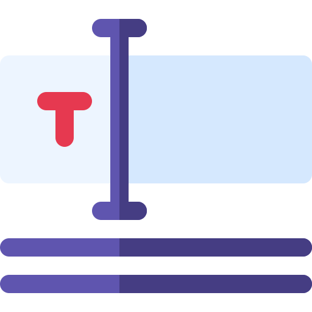

# DEVTREK 

A Blogging App

 

`This is app lets users to post blogs relating to the wide domain of technology`

* This is the basic version of the project. The app will be updated time to time with new features.
* This project lets users to write down their experiences and discoveries about the technologies to the world.
* Users can do CRUD operations on their posts.
* Users can read and like other posts too.

## TECH STACK

| Category | Software |
| -------- | -------- |
| OS | *Windows 10* |
| Frontend | *Embedded JS 3.1.6* `[JS Template Engine]` |
| Backend | *Express JS 4.17.1* `[JS Server Framework]` |
| Database | *Mongodb Atlas* |
| Server | *Node JS* `[JS Runtime Environment]` |
| IDE | *VS Code* |
| API Manager(for testing api's) | *Postman* |
| Hosting Platform | *Heroku* |

 

> For more details about packages and dependencies used in this app, please refer [package.json](https://github.com/cod-lab/devTrek/blob/main/package.json)
